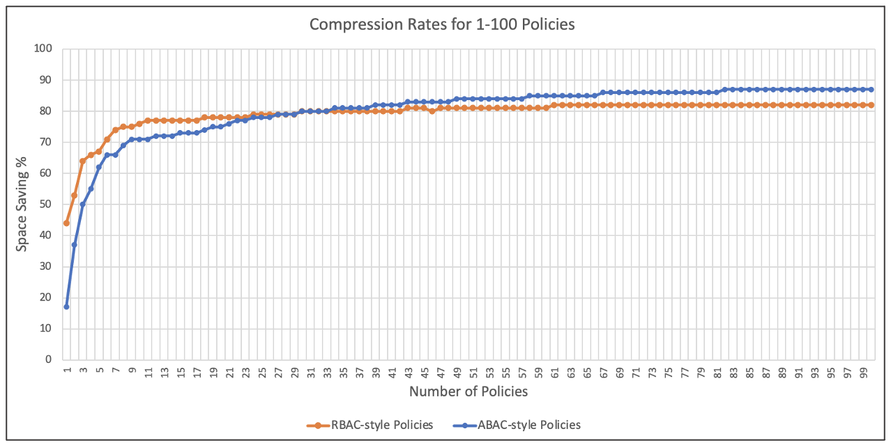

## How well do Cedar policies compress?

I was curious about this question as it could be useful information for scenarios ranging from storing lots of policies compactly to injecting a single policy into a space-constrained bearer token. The hunch was that Cedar policies would compress well due to the fixed structure of the language. After all, most policies start with the same 20 characters: `"permit (principal == "`.

This question can never lead to an absolute answer since compression rates vary by policy contents. After all, one could add a 10MB randomly-generated string into a policy and the compression rates would fall off a cliff, regardless of the algorithm. Nevertheless, ignoring pathological scenarios, I wanted to know the order of magnitude that one might expect from common cases. So, I spent an afternoon running a few experiments.

The answer, of course, is "it depends". Ratios ranged from 17% to 90%. But, it's fair to say that for files containing more than 50 policies, the compression ratio is likely to be over 80%. (Bigger is better for this ratio; 80% means a 10MB file would compress to 2MB.)

The remainder of this post describes the methodology and details.

### Experiment 1: More than 100 policies

I wrote a short program to randomly generate RBAC & ABAC style policies with varying conditions. To make it as unfair as possible, I used randomly generated strings for attribute names and values. In real life, most attribute name/value pairs are likely to be dictionary words, such as `"location": "Seattle"`, which may improve compression rates. But, I wanted to be pessimistic.

The first experiment used [zlib](https://en.wikipedia.org/wiki/Zlib) with default settings. I compressed various files containing 10K, 1K, and 100 policies where the policies were either pure RBAC, pure ABAC, or a mix. Here's the resulting compression ratios:

|                 | RBAC | ABAC | Mix |
|-----------------|------|------|-----|
| 100 Policies    | 81%  | 87%  | 82% |
| 1000 Policies   | 82%  | 90%  | 85% |
| 10,000 Policies | 82%  | 90%  | 86% |

As the table shows, all compression ratios fell between 80-90%. ABAC fared slightly better, likely because all the policies started with:
```
permit (principal, action, resource) when {
``` 
followed by conditions using common keywords like `principal`, `resource`, and `context`.

RBAC fared slightly worse, likely because of the random UUIDs sprinkled throughout.
```
permit (
    principal == ExampleApp::User::"a8e37111304143ae9cd75bf2625aa4ac",
    action in [
        ExampleApp::Action::"fvasthxzcm",
        ExampleApp::Action::"rrgoxrwupc",
        ExampleApp::Action::"ktjytscfvp"
    ],
    resource == ExampleApp::Resource::"daffb6288dfb4bb5a0c4df4de7ca76ba"
);
``` 

I tried a few variations that toggled zlib's configuration between fast vs. best compression rates, and while it varied the results by small percentage points, everything stayed in the 80-90% band. 

### Experiment 2: Fewer than 100 policies

Compression ratios are expected to worsen with smaller data sets and the subsequent experiments confirmed that. A single ABAC policy compressed by merely  **17%**. A single RBAC policy fared better at **44%**, likely assisted (as seen in the example above) by repetitive tokens such as `ExampleApp::Action::`

Between 1-100 policies was an inflection point. I iterated across that range to find the trend lines. Here's the results.



As it shows, having at least 10 policies is sufficient to gain a 70% compression rate, and having 40+ policies is sufficient to deliver 80%.

Fewer than 5 policies led to a precipitous drop and highly variable results that depended on the repetitiveness within the policies themselves. For example, a single RBAC policy with a long list of `ExampleApp::Action::` elements might compress by half due to the repetition of the actions, whereas an ABAC policy of equivalent length may barely compress at all. 

Was it possible to make the compression ratios more reliable? This led to the final experiment…

### Experiment 3: Using a Pre-built Dictionary 

The [ZStandard](https://en.wikipedia.org/wiki/Zstd) compression utility makes it easy to pre-generate a dictionary from a training dataset that can be used to improve the results when compressing small datasets. This is helpful because we know that all Cedar policies will contain similar elements, such as starting with `"permit (principal =="`. If this knowledge can be predefined in a dictionary, then compression activity can use that fact even when operating upon a single policy. 

To setup this experiment, I generated training data consisting of 10K random policies with a mixture of RBAC and ABAC, and then used the `zstd` tools to generate a dictionary and run another series of benchmarks. 

The results... the compression ratio for a single ABAC policy increased from 17% to 56%. And, an RBAC policy increased slightly from 44% to 48%.  

Once the number of policies increased to 5, results were on par with those from `zlib`. So, on the whole, a pre-built dictionary helped push the compression rate up to ~50% when compressing 1-2 policies, and had little effect beyond that. Advanced dictionary tuning may increase that further, but doing so was beyond the scope for this simple series of experiments.

### Takeaways 

With maximal laziness, using default compression settings, we might expect a compression ratio of 80-90% for 100+ policies.

Note that these tests were run using policies that all shared a uniform formatting convention and no inline comments. The addition of random whitespace and comments into Cedar policies, as might be anticipated if humans were writing them, could slightly dampen the rates. Therefore, stripping comments and re-formatting policies could be a beneficial prerequisite to compaction. These tests also relied upon synthetic data that may deviate from real-world policies; time will tell if the compression ratios hold true in production settings.

For a small number of policies, a pre-built dictionary could help deliver a lower bound of ~50% compression with minimal effort, and possibly more with extra dictionary tuning. This might be helpful, but is admittedly a fair amount of work to shave off a few bytes. As an alternative approach, one of the ideas that occasionally arises is the ability to pre-parse and pre-compile Cedar policies into a byte-code representation. This would have the effect of both shrinking the overall size and also lowering the evaluation cost, since policies arrive pre-compiled and ready to go. Therefore, if future scenarios arise where it would be beneficial to pack a small number of policies as tightly as possible (such as in bearer tokens), efforts might best be directed towards a Cedar byte-code representation instead of clever compression dictionaries. This path would deliver a more reliable win all-around and provide benefits to anyone who wants to reduce evaluation costs, regardless of the number of policies.  
